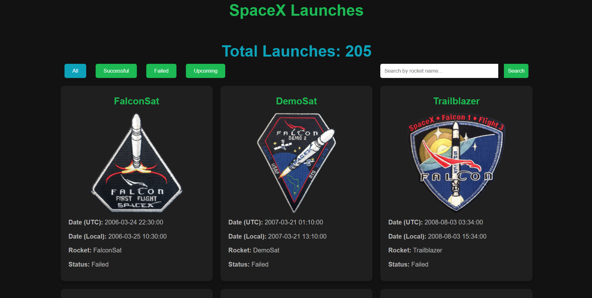
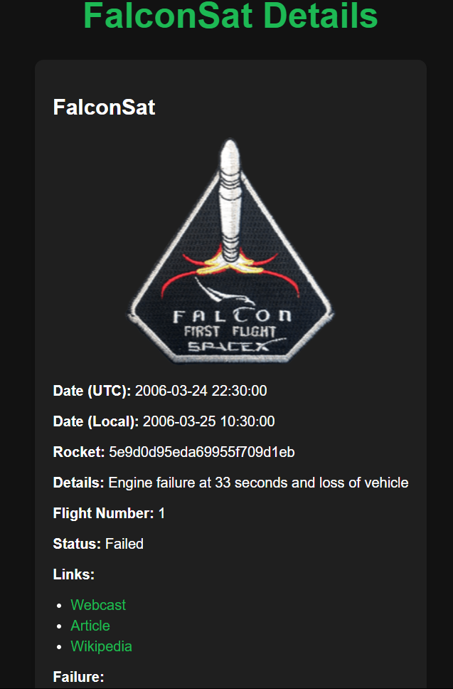

# SpaceX API Project

## Overview

This project is a Python Flask web application that interacts with the SpaceX API to retrieve and display information about SpaceX launches, rockets, and other related data.

## Live Demo

Check out the live demo [here](https://spacex-api-51ff.onrender.com/).

## Features

- Displays the latest SpaceX launch details.
- Lists all upcoming SpaceX launches.
- Provides information on all SpaceX rockets.
- Offers details on past SpaceX launches.

## Getting Started

### Prerequisites

- Python 3.x
- Flask
- Requests

### Installation

1. Clone the repository:

   ```sh
   git clone https://github.com/Oronno03/SpaceX-API.git
   ```

2. Navigate to the project directory:

   ```sh
   cd spacex-api
   ```

3. Install the required packages:
   ```sh
   pip install -r requirements.txt
   ```

### Running the App

1. Start the Flask application:

   ```sh
   python app.py
   ```

2. Open your web browser and go to:
   ```
   http://127.0.0.1:5000/
   ```

## Usage

After starting the app, you can navigate through the web interface to view various SpaceX data, including upcoming launches, rocket details, and past missions.

## Screenshots

### Home Page



### Launch Details



## License

This project is licensed under the MIT License - see the [LICENSE](LICENSE) file for details.
